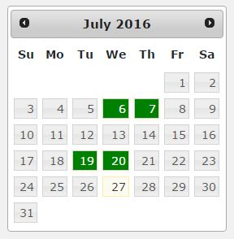

# cmb2-multidates-picker
Creates a CMB2 field that enables a multiple date calendar. It uses a plugin called [MultiDatesPicker v1.6.3 for jQuery UI](http://multidatespickr.sourceforge.net/)

## Usage
Create your cmb2 metabox like you are used to, but on your field, use the type **attribute => 'multidates'**

```php
$prefix = '_mdpt_';
$cmb_demo = new_cmb2_box(array(
	'id'			 => $prefix . 'metabox',
	'title'			 => __('Test Metabox', 'cmb2'),
	'object_types'	 => array('page',), // Post type
));
$cmb_demo->add_field(array(
	'name'	 => __('Test Text', 'cmb2'),
	'desc'	 => __('field description (optional)', 'cmb2'),
	'id'	 => $prefix . 'dates',
	'type'	 => 'multidates',
	
	//Any value from http://multidatespickr.sourceforge.net or http://api.jqueryui.com/datepicker/
	'multidates_params' => array(
		//'maxPicks'	 => 3,
		//'dateFormat'   => "y-m-d",
	),
));
```

## OPTIONS

As it uses [MultiDatesPicker v1.6.3 for jQuery UI](http://multidatespickr.sourceforge.net/), you can use a bunch of parameters from both MultiDatesPicker and also [JqueryUI Datepicker](http://api.jqueryui.com/datepicker/) itself.
You only have to use the 'multidates_params' like the code above. Example:

```php
'multidates_params' => array(
	//'maxPicks'	 => 3,
	//'dateFormat'   => "y-m-d", //Default is "yy-mm-dd"
	//pickableRange: 7,
)
```

## Screenshots

**This is the new field you get using this plugin**


